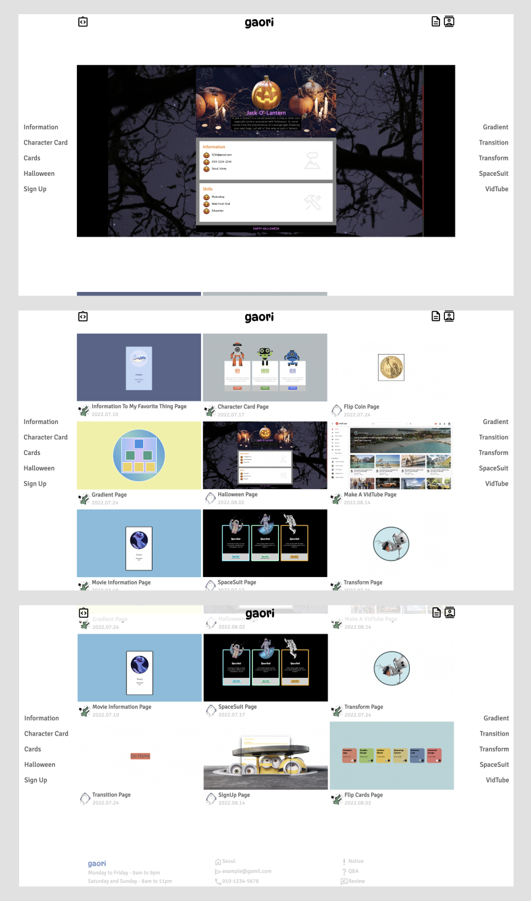

### 2022-summer-vacation-seminar

기간: 2022.07.01~2022.08.31
[ifp-2022-summer-seminar](https://ifp-2022-summer-seminar.netlify.app/)
메인 화면 및 주소

### 📝 Description

여름방학동안 [학과 동아리 IFP](https://github.com/IDU-IFP)에서 진행한 [세미나](https://github.com/IDU-IFP/ifp-2022-summer-vacation-seminar) 결과물을 통해 새로운 페이지를 만들었다.

IFP 학과 동아리에서 진행한 HTML/CSS 세미나 결과물을 기반으로 새로운 웹페이지를 제작해냈다. 해당 세미나에서는 웹페이지 제작에 필요한 기본적인 HTML/CSS 문법과 개념, 레이아웃 구성 방법 등을 배웠다.

새로 만든 웹페이지는 여름방학동안 개인적으로 수행한 프로젝트였다. 기존에 만들어진 세미나 결과물을 통합하여 페이지로 만들었다. 페이지에는 다양한 컨텐츠들이 포함되어 있다.

### 🔍 Preview

### **🧰 Tools**

  
  
  
  

